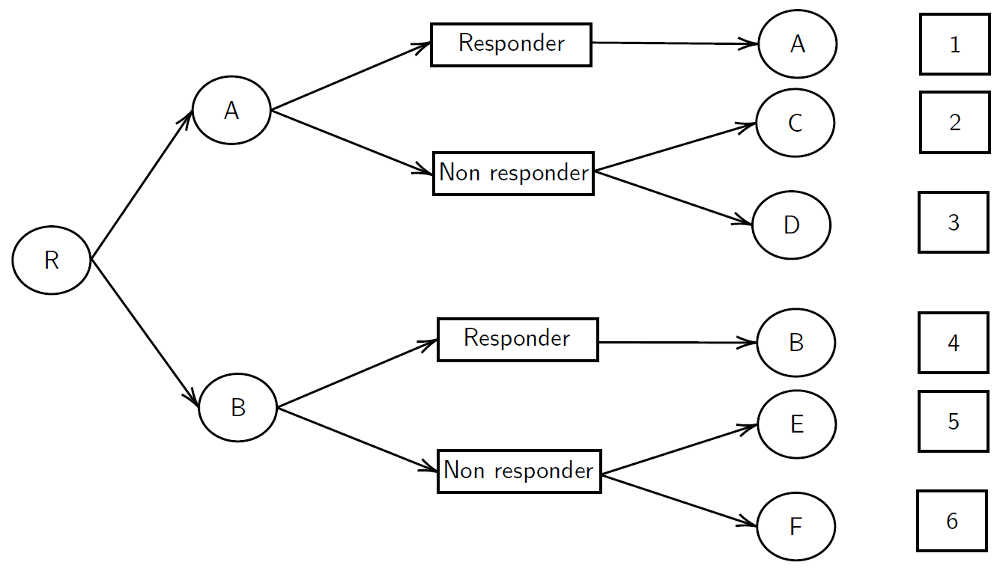

bayesSMARTsize
================


<!-- README.md is generated from README.Rmd. Please edit that file -->

# Introduction

`bayesSMARTsize` is a package which implements the functions for the
Bayesian ‘two priors’ approach sample size estimation of a 2-stages
sequential multiple assignment randomized trial (SMART) with continuous
outcomes for the comparison of two strategies with different initial
treatments. For a full description of this methodology, please refer to
Turchetta et al. (2021). In particular, the SMART design for which
sample size formulae are provided is the standard scheme represented
below, where responders to the stage-1 intervention are not
re-randomized.

<figure>
<figcaption aria-hidden="true">SMART scheme</figcaption>
</figure>

Despite this methodology is built on the continuous outcome setting, it
can still be used for binary outcomes, as the Normal approximation
performs well.

``` r
library(devtools)
install_github("aturchetta/bayesSMARTsize")
library(bayesSMARTsize)
set.seed(123)
```

# Data generating functions

`SMART.continuous` and `SMART.binary` can be used to simulate data from
a SMART with continuous and binary final outcomes respectively.
Considering the labels depicted in the figure above, the response rates
to the initial treatments `p_A` and `p_B` need to be specified in both
cases, however, generating data in the binary final outcome setting is
easier, as it only requires the specification of the response rates to
the various treatment sequences. See the example below for a SMART with
a sample size of 80 individuals.

``` r
sim_bin <- SMART.binary(n = 80, p_A = 0.3, p_AC = 0.4, p_AD = 0.3, p_AA = 1, 
                        p_B = 0.3, p_BE = 0.2, p_BF = 0.2, p_BB = 1 )
```

In the continuous setting, the outcome is drawn from a Normal
distribution with mean E\[*Y*\|*A*<sub>1</sub>, *R*, *A*<sub>2</sub>\]
and variance Var\[*Y*\|*A*<sub>1</sub>, *R*, *A*<sub>2</sub>\], where
*A*<sub>*j*</sub> represent the treatment assigned at stage *j* and *R*
the response to the stage-1 intervention (1 for responders and 0 for
non-responders). Expressing the conditional mean of the outcome as

the algorithm to simulate requires the specification of 12 parameters: 6
parameters for the conditional mean (`phi_1,...,phi_6`) and 6 standard
deviation values (`sd_aa,sd_ac,sd_ad,sd_bb,sd_be,sd_bf`). See the
example below.

``` r
sim_cont <- SMART.continuous(n = 80, p_A = 0.5, p_B = 0.5, phi_1 = 10, phi_2 = 5, phi_3 = -15,
                             phi_4 = -3, phi_5 = 10, phi_6 = -3, sd_aa = 2, sd_ac = 2, sd_ad = 2,
                             sd_bb = 2, sd_be = 3, sd_bf = 2)
```

Both functions return a data frame with 4 columns: the stage-1
intervention label, the sequence of treatments label, the final outcome,
and the response indicator to the first treatment are returned:

``` r
head(sim_bin)
#>   tr1 tr2 outcome R
#> 1   A  AD       0 0
#> 2   B  BE       0 0
#> 3   B  BE       0 0
#> 4   A  AD       0 0
#> 5   A  AD       1 0
#> 6   A  AD       1 0

head(sim_cont)
#>   tr1 tr2   outcome R
#> 1   B  BF -1.089412 0
#> 2   B  BB  8.779077 1
#> 3   A  AA 12.365968 1
#> 4   B  BE  5.972913 0
#> 5   B  BF -6.004397 0
#> 6   A  AA 15.925476 1
```

# Estimator function

`SMART.est` can be used to estimate the mean
*μ̂*<sub>*d*̅<sub>*k*</sub></sub> and its estimator’s variance
*τ*<sub>*d*̅<sub>*k*</sub></sub><sup>2</sup> of a strategy
*d*̅<sub>*k*</sub>. Let us take as an example the data set generated in
the previous section in the binary outcome setting and let us consider
the strategy ‘administer A and, if there is no response, administer C.’
Since responders are not randomized again, only the label of the stage-2
intervention is required, and in this case the label is ‘AC’:

``` r
SMART.est(tr1 = sim_bin$tr1, tr2 = sim_bin$tr2, outcome = sim_bin$outcome,
           R = sim_bin$R, id1 = "A", id2 = "AC")
#> $mu
#> [1] 0.8461538
#> 
#> $tau
#> [1] 0.4946746
```

# Sample size estimation

`SMART.ss` computes the required sample size to achieve the desired
level of power. Let us consider the alternative hypothesis
H<sub>1</sub> : *μ*<sub>*d*̅<sub>*k*</sub><sup>1</sup></sub> − *μ*<sub>*d*̅<sub>*k*</sub><sup>2</sup></sub> &gt; 0.
The Bayesian methodology implemented in this function is based on the
use of the posterior distribution of the variance components estimated
from pilot data to marginalize the power function. Therefore, this
function requires data from the pilot study through the set of
parameters
{`tr1, tr2, outcome, R, id1_study, id2_study, id1_ref, id2_ref`}.
Alternatively, one can directly specify the posterior parameters of the
inverse chi-squared distribution of
*τ*<sub>*d*̅<sub>*k*</sub><sup>1</sup></sub><sup>2</sup> + *τ*<sub>*d*̅<sub>*k*</sub><sup>2</sup></sub><sup>2</sup>
through the parameters `vn` and `sigma_n`. Note that only one of the two
choices must be specified in the function. Let us consider the data
simulated in the binary outcome setting as the result of a pilot study
and let us size the full-scale SMART for the comparison of
‘*d*̅<sub>*k*</sub><sup>1</sup>: administer A and, if there is no
response, switch to C" and ‘*d*̅<sub>*k*</sub><sup>2</sup>: administer B
and, if there is no response,switch to E.’ We size the SMART in order to
achieve a 90% power under the design prior distribution of the mean
difference between strategies
*π*<sub>*d*</sub>(*θ*) = 𝒩(*θ*;0.1,0.02<sup>2</sup>) and we set the
Bayesian significance level to 0.95 (`epsilon=0.05`). To complete the
Bayesian framework, we set the analysis prior
*π*<sub>0</sub>(*θ*) = 𝒩(*θ*;0,0.15<sup>2</sup>). For further details on
this methodology, please consult Turchetta et al. (2021). Finally, a
grid of sample size values which is used to search for the optimal
sample size needs to be specified through `n_grid`. By default, the
function outputs the estimated sample size and the corresponding power:

``` r
SMART.ss(n_grid = seq(100,1200), theta_0=0, sigma_0 = 0.15,
                 theta_d=0.1, sigma_d = 0.01, power = 0.9, epsilon = 0.05,
                 tr1 = sim_bin$tr1, tr2 = sim_bin$tr2, outcome = sim_bin$outcome, R = sim_bin$R,
                 id1_study = "A", id2_study = "AB", id1_ref = "B", id2_ref = "BE")
#>   Sample_size     Power
#> 1         964 0.9002337
```

Selecting the option `save_grid=TRUE`, an additional data frame which
includes the power level estimated for each value of `n_grid` is
returned:

``` r
grid <- SMART.ss(n_grid = seq(400,1000), theta_0=0, sigma_0 = 0.15,
                 theta_d=0.1, sigma_d = 0.01, power = 0.9, epsilon = 0.05,
                 tr1 = sim_bin$tr1, tr2 = sim_bin$tr2, outcome = sim_bin$outcome, R = sim_bin$R,
                 id1_study = "A", id2_study = "AB", id1_ref = "B", id2_ref = "BE", save_grid=TRUE)

head(grid[[2]])
#>     n     Power
#> 1 400 0.5896011
#> 2 401 0.5906061
#> 3 402 0.5916087
#> 4 403 0.5926091
#> 5 404 0.5936072
#> 6 405 0.5946029
```

Additionally, it is possible to center the analysis prior
*π*<sub>0</sub> at the mean difference between strategies estimated via
pilot data through the option `theta_0="pilot"`. In this case,
incrementing the variance of the analysis prior to 0.5<sup>2</sup>, the
sample size is reduced to

``` r
SMART.ss(n_grid = seq(100,1200), theta_0="pilot", sigma_0 = 0.5,
                 theta_d=0.1, sigma_d = 0.01, power = 0.9, epsilon = 0.05,
                 tr1 = sim_bin$tr1, tr2 = sim_bin$tr2, outcome = sim_bin$outcome, R = sim_bin$R,
                 id1_study = "A", id2_study = "AB", id1_ref = "B", id2_ref = "BE")
#>   Sample_size     Power
#> 1         885 0.9000118
```

# References

<div id="refs" class="references csl-bib-body hanging-indent">

<div id="ref-smart_bay" class="csl-entry">

Turchetta, Armando, Erica EM Moodie, David A Stephens, and Sylvie D
Lambert. 2022. “Bayesian Sample Size Calculations for Comparing Two Strategies in SMART Studies.” Biometrics.

</div>

</div>
